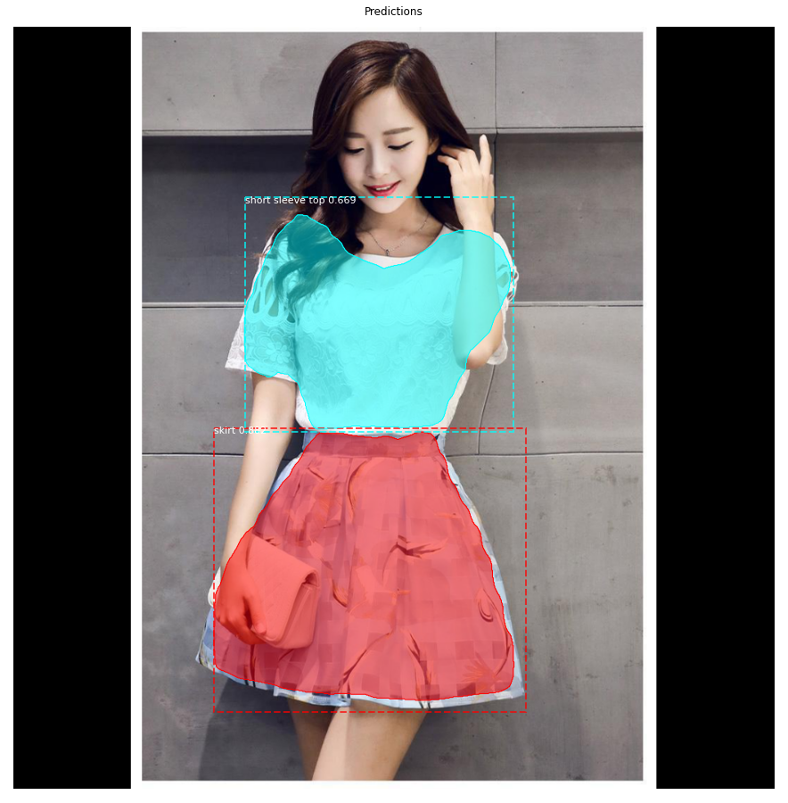

# Segmentation with Mask R-CNN





## Dataset
DeepFashion2 - https://github.com/switchablenorms/DeepFashion2

## Requirements
TensorFlow 1.x, Keras 2.0.8 and other common packages listed in [requirements.txt](https://github.com/matterport/Mask_RCNN)

## Installation
1. Clone this repository
2. Create folder `data`. Download dataset and put in folder `data`
3. Clone [Mask_RCNN](https://github.com/matterport/Mask_RCNN)
4. Install Mask_RCNN's dependencies and setup

## Train
```
python deepfashion2.py train --dataset='data' --weights=coco
```

Best weight: [mask_rcnn_fashion_0119.h5](https://drive.google.com/file/d/1eZIxmBvTsfYAXlebAQrnKsexobc7bQQb/view?usp=sharing)


Details at `train_colab.ipynb` or [Google Colab](https://colab.research.google.com/drive/1SMkgzluyvFkP_pXo5ijyB0jn0hMtY7h2?usp=sharing)

## Evaluation
```
python deepfashion2.py evaluate --dataset='data' --weights='/path/to/weight'
```
Result in validation set - **mAP @ IoU=50: 0.52**

## Inference
```
python deepfashion2.py splash --weights="/path/to/weight" --image='/path/to/image'
```

## Demo
```
python demo.py
```

## References
https://github.com/matterport/Mask_RCNN